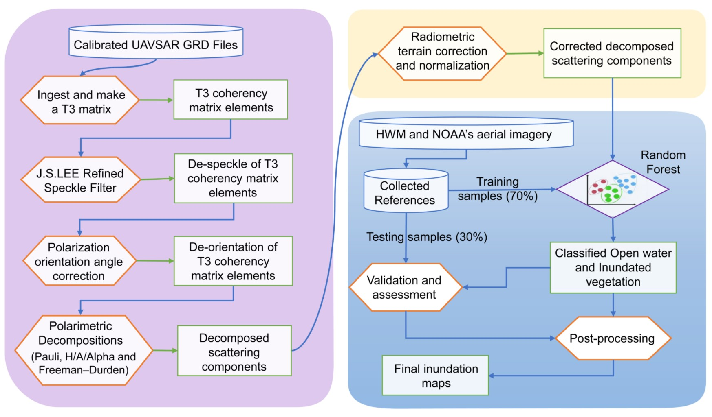

This is repository used to hold the scripts used for the manuscript named: 
# "Flood extent mapping during Hurricane Florence with repeat-pass L-band UAVSAR images"
This research was financially supported by the Dynamics of Extreme Events, People, and Places (DEEPP) project (https://deepp.cpc.unc.edu/).

Chao Wang<sup>1</sup>, Tamlin M. Pavelsky<sup>1</sup>, Fangfang Yao<sup>2</sup>, Xiao Yang<sup>1</sup>, Shuai Zhang<sup>3</sup>, Bruce Chapman<sup>4</sup>, Conghe Song<sup>5</sup>, Antonia Sebastian<sup>1</sup>, Brian Frizzelle<sup>6</sup>, Elizabeth Frankenberg<sup>7</sup> 
</br>1Department of Geological Sciences, University of North Carolina, Chapel Hill, NC, USA
</br>2CIRES University of Colorado Boulder, Boulder, CO, USA
</br>3College of Marine Science, University of South Florida, St. Petersburg, FL, USA 
</br>4Jet Propulsion Laboratory, California Institute of Technology, Pasadena, CA, USA
</br>5Department of Geography, University of North Carolina, Chapel Hill, NC, USA
</br>6Carolina Population Center, University of North Carolina, Chapel Hill, NC, USA
</br>7Department of Sociology and Carolina Population Center, University of North Carolina, Chapel Hill, NC, USA

### Introduction
We constructed a flood detection algorithm framework (Fig below), including extraction of T3 coherency matrix elements, “Refined Lee Filter” speckle filtering, polarization orientation angle correction, polarimetric decomposition, radiometric terrain correction, radiometric normalization, and supervised classification. The basic processing flow and the auxiliary data sets used are illustrated in Fig. 2. The workflow includes three major components. The processing steps in the pink box were carried out using the European Space Agency (ESA) PolSARpro v6.2 software package (Pottier et al, 2009) through custom python batch scripts. The steps in the light yellow and light blue boxes were implemented in the Google Earth Engine (GEE) platform using the python (v3.7.3) API (v0.1.200) because it provides online cloud computing tools and a flexible interactive development environment, facilitating easy sharing and reproducibility (Gorelick et al. 2017). These steps include radiometric terrain correction, radiometric normalization, and supervised classification modules.

The proposed framework for flood inundation mapping from UAVSAR imagery has two components:
1) Local Processing:
A) UAVSAR fully polarimetric extraction 
B) Polarietric de-speckling, de-orientation 
C) Polarimetric decomposition

2) Cloud-based Processing:
A) Polarimetric terrain correction and normalization
B) Supervised Classification



# Data

# How to start

# Requirements
Find the right version for your setup of Anaconda3 platform for running python scripts. In this study, we used Spyder IDE. In addition, for this pipeline to work you will need to have a GEE configured python installation ready to go.

## Installation
Check the file of 'requirements.txt'. For install GEE python API, please check 'GEE Python Instructions'.

# GEE Python Instructions

Explaining exactly how to do this is beyond the scope of this package but Google provides detailed installation instructions [here](https://developers.google.com/earth-engine/python_install).


## Usage
Step1:
Local processing:
1)

```javascript
// Store in a variable (see below).

```
Step2:
Upload input metrics raster files (here, we used Cloud Optimized GeoTIFF, https://www.cogeo.org/), because we processed lots of raster data so that we prefer to use Google Cloud Storage(GCS, https://developers.google.com/earth-engine/Earth_Engine_asset_from_cloud_geotiff?hl=en). 
Of course, you can upload to GEE assets instead of GCS. 
UploadUAVSARGeoTiff2CloudStorage.ipynb

Step3:
Conduct normalization and classification:
Before conducting normalization procedure, it requires the incidence angle raster file instead of provided local incidence angle file (which has taken into account the local topography), because our study sites are relatively flat and also we have already conducted terrain correction.
The script named 'DownloadIncidenceAngle_4.py' was used to generate incidence angle used later.
The script named 'GetNormalizationCorrectionParameters_6.py' was then used for extracted the parameters for correcting side-look gradient. specifically, we adopted a simple log-scaled linear regression.

## Resources
The material is made available under the **MIT License**: Copyright 2021, Chao Wang, Tamlin M. Pavelsky, of Global Hydrology Lab - University of North Carolina, Chapel Hill.
All rights reserved.
